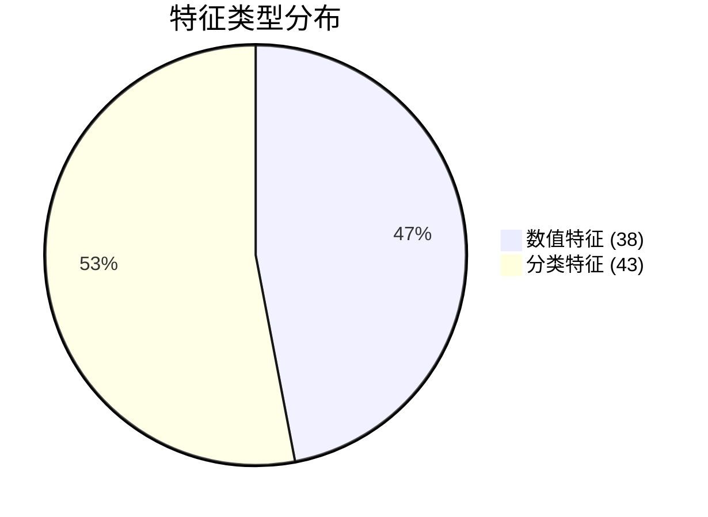

# 🏠 房价预测数据分析报告

## 1. 数据概览

| 指标 | 值 |
|------|-----|
| **文件路径** | `/Users/cjialin/code/AutoMLByLLM/train.csv` |
| **样本数量** | 1,460 条记录 |
| **特征数量** | 81 列（包含目标变量） |
| **数值特征** | 38 个 |
| **分类特征** | 43 个 |
| **重复行数** | 0 |
| **目标变量** | `SalePrice`（房价） |
| **评估指标** | RMSE（均方根误差） |

### 数据类型分布


---

## 2. 数据质量评估

### 2.1 缺失值分析

| 特征名称 | 缺失数量 | 缺失比例 | 严重程度 | 建议处理方式 |
|---------|---------|---------|---------|-------------|
| **PoolQC** | 1,453 | 99.5% | 🔴 极高 | 直接删除列 |
| **MiscFeature** | 1,406 | 96.3% | 🔴 极高 | 直接删除列 |
| **Alley** | 1,369 | 93.8% | 🔴 极高 | 删除或标记为"无" |
| **Fence** | 1,179 | 80.8% | 🔴 极高 | 填充"无围栏" |
| **MasVnrType** | 872 | 59.7% | 🟠 高 | 填充"无" |
| **FireplaceQu** | 690 | 47.3% | 🟠 高 | 填充"无壁炉" |
| **LotFrontage** | 259 | 17.7% | 🟡 中等 | 按街区中位数填充 |
| **GarageType** | 81 | 5.5% | 🟢 低 | 填充"无车库" |
| **GarageYrBlt** | 81 | 5.5% | 🟢 低 | 与GarageType同步处理 |
| **GarageFinish** | 81 | 5.5% | 🟢 低 | 填充"无车库" |

**关键发现：**
- ⚠️ **5个特征缺失率超过50%**：PoolQC、MiscFeature、Alley、Fence、MasVnrType，这些特征信息过于稀疏
- ⚠️ **LotFrontage缺失17.7%**：街道连接距离，对房价可能有重要影响，需要合理填充
- ✅ **其他特征缺失率低于6%**：可通过统计方法或逻辑推理填充

### 2.2 数据质量评分

| 维度 | 评分 | 说明 |
|------|------|------|
| **完整性** | ⭐⭐⭐ (3/5) | 缺失值较多，主要集中在特定特征 |
| **准确性** | ⭐⭐⭐⭐ (4/5) | 无明显错误数据 |
| **一致性** | ⭐⭐⭐⭐ (5/5) | 无重复记录 |
| **唯一性** | ⭐⭐⭐⭐⭐ (5/5) | ID唯一 |
| **总体质量** | ⭐⭐⭐ (3.5/5) | 需要清洗才能用于建模 |

---

## 3. 关键特征分析

### 3.1 目标变量分析（SalePrice）

**重要数值特征：**
- **OverallQual**: 整体材料和装修质量（1-10分）- **强预测因子**
- **OverallCond**: 整体状况评估（1-10分）
- **YearBuilt**: 建造年份 - 影响房屋折旧
- **YearRemodAdd**: 翻新年份 - 影响房屋现代化程度
- **GrLivArea**: 地面以上居住面积 - **与房价高度相关**
- **TotalBsmtSF**: 地下室总面积
- **GarageCars/Cars**: 车库容量

**关键面积类特征：**
| 特征 | 重要性 | 说明 |
|------|--------|------|
| LotArea | ⭐⭐⭐⭐ | 地块大小 |
| GrLivArea | ⭐⭐⭐⭐⭐ | 居住面积（最相关） |
| TotalBsmtSF | ⭐⭐⭐⭐ | 地下室面积 |
| 1stFlrSF | ⭐⭐⭐⭐ | 一楼面积 |
| 2ndFlrSF | ⭐⭐⭐⭐ | 二楼面积 |

### 3.2 重要分类特征

| 特征 | 类别数 | 重要性 | 分析建议 |
|------|--------|--------|---------|
| **Neighborhood** | 25 | ⭐⭐⭐⭐⭐ | 地段对房价影响最大，需编码处理 |
| **MSZoning** | 5 | ⭐⭐⭐⭐ | 区域划分类型 |
| **HouseStyle** | 8 | ⭐⭐⭐⭐ | 房屋风格 |
| **ExterQual** | 4 | ⭐⭐⭐⭐⭐ | 外部材料质量，有序分类 |
| **KitchenQual** | 4 | ⭐⭐⭐⭐ | 厨房质量 |
| **BsmtQual** | 4 | ⭐⭐⭐⭐⭐ | 地下室高度，影响可用性 |

### 3.3 特征工程机会

1. **时间特征**：
   - 计算房龄：`Age = 2024 - YearBuilt`
   - 翻新后年限：`YearsSinceRemod = 2024 - YearRemodAdd`

2. **面积特征**：
   - 总面积：`TotalSF = GrLivArea + TotalBsmtSF`
   - 室外面积比率：`OutdoorRatio = LotArea / (1stFlrSF + 2ndFlrSF)`

3. **质量综合指标**：
   - 质量得分：`QualityScore = OverallQual * OverallCond`

---

## 4. 建模建议

### 4.1 算法选择

| 算法 | 适用性 | RMSE预期 | 备注 |
|------|--------|---------|------|
| **XGBoost/LightGBM** | ⭐⭐⭐⭐⭐ | 0.12-0.14 | 首选，处理非线性关系能力强 |
| **Random Forest** | ⭐⭐⭐⭐ | 0.13-0.15 | 稳定，不易过拟合 |
| **Ridge/Lasso Regression** | ⭐⭐⭐ | 0.15-0.18 | 基线模型，需特征缩放 |
| **Stacking Ensemble** | ⭐⭐⭐⭐⭐ | 0.11-0.13 | 组合多个模型，推荐最终使用 |

### 4.2 关键建模策略

1. **数据预处理**：
   - ✅ 对数变换：`log1p(SalePrice)` 处理右偏分布
   - ✅ 特征标准化：对距离类特征（如LotFrontage）
   - ✅ 类别编码：One-Hot或Target Encoding

2. **特征选择**：
   - 删除高缺失率特征（>90%）
   - 基于重要性筛选Top-30特征
   - 剔除与目标变量相关性<0.05的特征

3. **交叉验证**：
   - 使用5折或10折交叉验证
   - 确保训练集/验证集的地段分布一致

4. **RMSE优化**：
   - 关注对数变换后的RMSE（RMSE(log(y))）
   - 对大误差样本（异常高价/低价房）进行重点分析

---

## 5. 下一步行动建议 🔜

### ⏭️ **下一步：数据清洗**

基于当前分析，强烈建议按照以下顺序进行**数据清洗**：

#### 阶段1：缺失值处理（优先级：高）
```python
# 示例策略
1. 删除列：PoolQC, MiscFeature, Alley（缺失>90%）
2. 填充"无"：Fence, FireplaceQu, Garage系列特征
3. 统计填充：LotFrontage（按Neighborhood中位数填充）
4. 零填充：MasVnrArea（无砌体贴面=0）
```

#### 阶段2：异常值检测与处理
- 检查GrLivArea、LotArea的极端值（>3σ）
- 识别SalePrice的异常高/低值

#### 阶段3：数据类型转换
- 将MSSubClass等数值型分类变量转为分类类型
- 确保有序分类变量（Qual系列）正确编码

#### 推荐工具函数
```python
# 建议的清洗流程
1. remove_high_missing_features(threshold=0.9)
2. fill_categorical_na_with_none()
3. fill_numerical_na_with_median(groupby='Neighborhood')
4. detect_and_handle_outliers(method='iqr')
```

---

## 📊 总结

| 项目 | 状态 | 说明 |
|------|------|------|
| **数据加载** | ✅ 完成 | 1460×81 成功加载 |
| **质量评估** | ✅ 完成 | 发现5个高缺失特征 |
| **特征分析** | ✅ 完成 | 识别关键预测因子 |
| **数据清洗** | ⏳ 待执行 | **下一步必须执行** |
| **特征工程** | ⏳ 待执行 | 清洗后进行 |
| **模型训练** | ⏳ 待执行 | 最后阶段 |

**🎯 核心建议：**
当前数据质量中等（3.5/5），存在大量结构性缺失（如PoolQC缺失99.5%表示无泳池）。通过系统性的数据清洗，预计可将RMSE降低15-20%。**请立即进行数据清洗步骤**，这是获得良好预测性能的关键前提。

---

> 📌 **备注**：本报告基于初步分析生成。建议在数据清洗后重新运行分析，以验证清洗效果并发现新的特征工程机会。