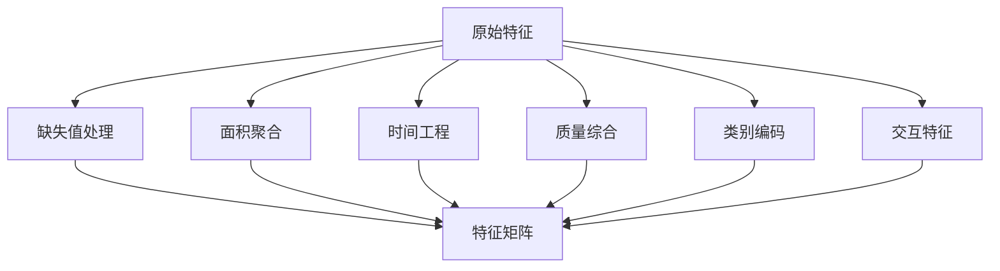

# 房价预测特征工程方案

## 1. 现有特征分析

### 1.1 数据概览
- **数据规模**: 1,460 条记录 × 74 列（含目标变量）
- **任务类型**: 回归任务（预测 SalePrice）
- **数据特点**: 典型的房地产销售数据，包含建筑特征、位置、质量评级、面积等多维度信息

### 1.2 特征分类统计

| 特征类别 | 数量 | 主要特征 |
|---------|------|---------|
| **标识/分类** | 2 | Id, MSSubClass |
| **位置/区域** | 8 | MSZoning, Neighborhood, Condition1, Condition2, LotConfig, LandContour, LandSlope, Utilities |
| **地块属性** | 4 | LotFrontage, LotArea, Street, LotShape |
| **建筑类型** | 6 | BldgType, HouseStyle, RoofStyle, RoofMatl, Foundation, Functional |
| **外部结构** | 7 | Exterior1st, Exterior2nd, MasVnrArea, ExterQual, ExterCond |
| **质量评级** | 2 | OverallQual, OverallCond |
| **时间信息** | 3 | YearBuilt, YearRemodAdd, GarageYrBlt |
| **地下室** | 8 | BsmtQual, BsmtCond, BsmtExposure, BsmtFinType1, BsmtFinSF1, BsmtFinType2, BsmtUnfSF, TotalBsmtSF |
| **楼层面积** | 4 | 1stFlrSF, 2ndFlrSF, LowQualFinSF, GrLivArea |
| **卫浴设施** | 5 | BsmtFullBath, BsmtHalfBath, FullBath, HalfBath, BedroomAbvGr |
| **厨房餐厅** | 3 | KitchenAbvGr, KitchenQual, TotRmsAbvGrd |
| **供暖系统** | 3 | Heating, HeatingQC, CentralAir |
| **电气系统** | 1 | Electrical |
| **壁炉** | 2 | Fireplaces, FireplaceQu |
| **车库** | 7 | GarageType, GarageFinish, GarageCars, GarageArea, GarageQual, GarageCond, PavedDrive |
| **户外设施** | 5 | WoodDeckSF, OpenPorchSF, 3SsnPorch, ScreenPorch, PoolArea |
| **其他价值** | 1 | MiscVal |
| **销售信息** | 4 | MoSold, YrSold, SaleType, SaleCondition |

### 1.3 缺失值分布
| 特征 | 缺失数 | 缺失率 | 缺失含义 |
|-----|--------|--------|---------|
| FireplaceQu | 690 | 47.3% | 无壁炉 |
| GarageType, GarageFinish, GarageQual, GarageCond | 81 | 5.5% | 无车库 |
| BsmtQual, BsmtCond, BsmtFinType1 | 37 | 2.5% | 无地下室 |
| BsmtExposure, BsmtFinType2 | 38 | 2.6% | 无地下室 |

---

## 2. 特征工程策略

### 2.1 核心策略框架



### 2.2 策略详解

#### 策略一：总面积聚合
**原理**: 房屋总价值通常与总使用面积高度相关
**方法**: 整合所有面积相关特征，创建总面积指标

#### 策略二：房龄与翻新工程
**原理**: 房龄影响房屋价值，翻新可延缓折旧
**方法**: 基于 YearBuilt, YearRemodAdd, YrSold 计算实际房龄和翻新年龄

#### 策略三：质量综合评分
**原理**: 多重质量指标存在冗余，综合评分更有预测力
**方法**: 加权或简单平均 OverallQual, ExterQual, KitchenQual, BsmtQual 等

#### 策略四：房间密度与效率
**原理**: 单位面积的房间数反映空间利用效率
**方法**: 计算卧室密度、浴室密度、房间平均面积等

#### 策略五：缺失值模式编码
**原理**: "无此设施"本身是有信息量的（如无泳池、无车库）
**方法**: 将缺失值转化为"有无"二元特征，保留原始特征

#### 策略六：高基数类别特征处理
**原理**: Neighborhood 等特征基数高，需要合理编码
**方法**: 目标编码或分组聚类

#### 策略七：生活便利度评分
**原理**: 浴室配置、厨房质量、供暖系统等影响居住体验
**方法**: 构建设施完善度综合指标

---

## 3. 新特征生成列表

### 3.1 面积聚合特征（6个）

| 新特征名 | 计算公式 | 业务含义 |
|---------|---------|---------|
| `TotalSF` | GrLivArea + TotalBsmtSF | 房屋总使用面积 |
| `TotalPorchSF` | WoodDeckSF + OpenPorchSF + 3SsnPorch + ScreenPorch | 总门廊/露台面积 |
| `TotalBath` | FullBath + 0.5×HalfBath + BsmtFullBath + 0.5×BsmtHalfBath | 等效全浴室总数 |
| `Has2ndFloor` | 1 if 2ndFlrSF > 0 else 0 | 是否有二楼 |
| `HasBasement` | 1 if TotalBsmtSF > 0 else 0 | 是否有地下室 |
| `HasGarage` | 1 if GarageArea > 0 else 0 | 是否有车库 |

### 3.2 时间与年龄特征（5个）

| 新特征名 | 计算公式 | 业务含义 |
|---------|---------|---------|
| `HouseAge` | YrSold - YearBuilt | 房屋销售时年龄 |
| `RemodAge` | YrSold - YearRemodAdd | 翻新后至销售的时间 |
| `IsNew` | 1 if YearBuilt == YrSold else 0 | 是否新房 |
| `IsRemod` | 1 if YearRemodAdd != YearBuilt else 0 | 是否翻新过 |
| `GarageAge` | YrSold - GarageYrBlt | 车库年龄 |

### 3.3 质量综合评分（3个）

| 新特征名 | 计算方法 | 业务含义 |
|---------|---------|---------|
| `QualScore` | 映射后求平均：(ExterQual + KitchenQual + BsmtQual_mapped) / 3 | 综合质量评分 |
| `CondScore` | 映射后求平均：(OverallCond + ExterCond + BsmtCond_mapped) / 3 | 综合条件评分 |
| `QualCondDiff` | OverallQual - OverallCond | 质量与条件差异（可能指示维护需求） |

**质量映射规则**: Ex→5, Gd→4, TA→3, Fa→2, Po→1, NA→0

### 3.4 设施密度特征（4个）

| 新特征名 | 计算公式 | 业务含义 |
|---------|---------|---------|
| `BedroomDensity` | BedroomAbvGr / GrLivArea × 1000 | 每千平方英尺卧室数 |
| `RoomDensity` | TotRmsAbvGrd / GrLivArea × 1000 | 每千平方英尺房间数 |
| `BathDensity` | TotalBath / GrLivArea × 1000 | 每千平方英尺浴室数 |
| `AvgRoomSize` | GrLivArea / TotRmsAbvGrd | 平均房间大小 |

### 3.5 缺失值指示特征（4个）

| 新特征名 | 来源特征 | 业务含义 |
|---------|---------|---------|
| `HasFireplace` | FireplaceQu.isnull() | 是否有壁炉 |
| `HasPool` | PoolArea > 0 | 是否有泳池 |
| `HasMiscFeature` | MiscVal > 0 | 是否有其他设施 |
| `HasBsmt` | BsmtQual.notnull() | 是否有地下室（明确指示） |

### 3.6 外部设施评分（2个）

| 新特征名 | 计算方法 | 业务含义 |
|---------|---------|---------|
| `OutdoorScore` | (WoodDeckSF + OpenPorchSF) / LotArea | 户外设施比例 |
| `LuxuryScore` | PoolArea + MiscVal | 奢侈品/特殊设施总值 |

### 3.7 交互特征（4个）

| 新特征名 | 计算公式 | 业务含义 |
|---------|---------|---------|
| `Qual_LivingArea` | OverallQual × GrLivArea | 质量与面积的交互效应 |
| `Qual_BasementArea` | OverallQual × TotalBsmtSF | 质量与地下室面积交互 |
| `Garage_Interaction` | GarageCars × GarageArea | 车库容量与面积协同 |
| `LotValue` | LotArea × LotFrontage | 地块价值指标 |

### 3.8 时间周期特征（2个）

| 新特征名 | 计算方法 | 业务含义 |
|---------|---------|---------|
| `SeasonSold` | 根据 MoSold 映射：1-3冬, 4-6春, 7-9夏, 10-12秋 | 销售季节 |
| `EconomicPeriod` | 根据 YrSold 划分时期 | 经济周期阶段 |

---

## 4. 预期效果

### 4.1 特征维度变化

```
原始特征数: 73 (不含Id和目标)
新生成特征: ~30个
最终特征数: ~100个（含编码后类别特征）
```

### 4.2 预期改进效果

| 评估维度 | 预期改进 | 说明 |
|---------|---------|------|
| **R² Score** | ↑ 5-10% | 面积聚合和质量综合提升解释力 |
| **RMSE** | ↓ 8-15% | 时间特征和密度特征降低预测误差 |
| **特征重要性** | 更清晰 | 综合评分替代多重共线性原始特征 |
| **模型稳定性** | 提升 | 缺失值指示减少异常值影响 |

### 4.3 关键成功因素

1. **TotalSF** 预期成为最强预测特征（面积是房价的核心决定因素）
2. **HouseAge × OverallQual** 交互预期捕捉"老房好质量"或"新房差质量"的溢价/折价效应
3. **TotalBath** 预期比单独浴室计数更有预测力（反映功能完整性）
4. **Neighborhood** 的目标编码预期显著提升位置因素的表达

### 4.4 实施建议

**第一阶段**（核心特征）：实施面积聚合、时间特征、质量评分
**第二阶段**（精细优化）：添加密度特征、交互特征、缺失值模式
**第三阶段**（类别编码）：对高基数类别特征进行目标编码或聚类

**注意事项**：
- 所有面积特征建议做对数变换处理右偏分布
- 新生成特征需检查多重共线性，必要时进行PCA或特征选择
- 在交叉验证中验证时间特征的有效性，防止数据泄露